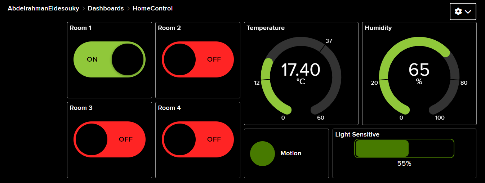
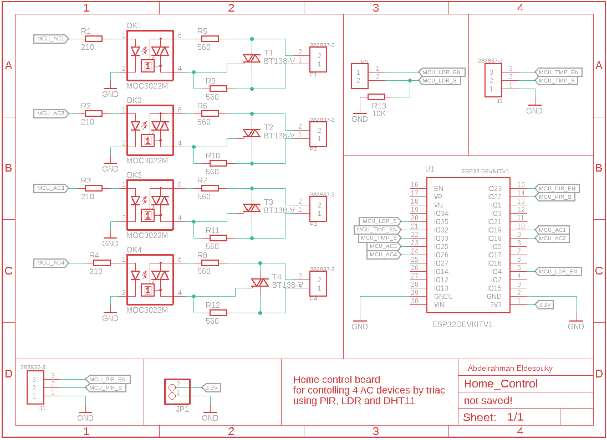
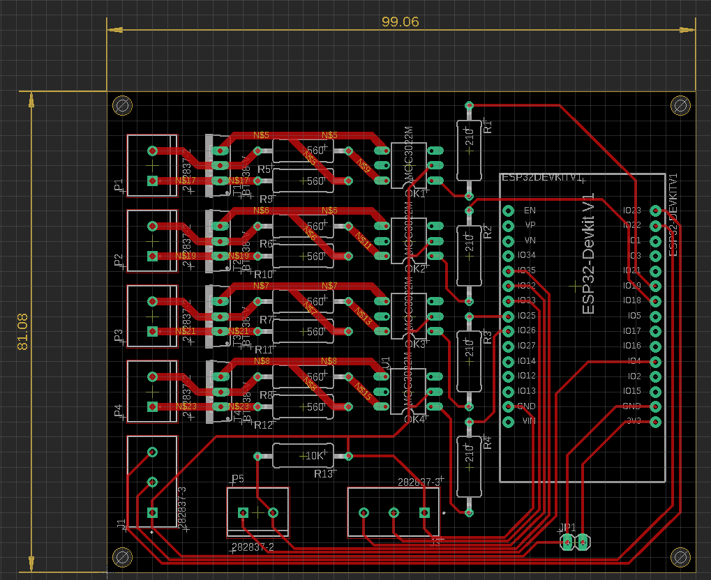
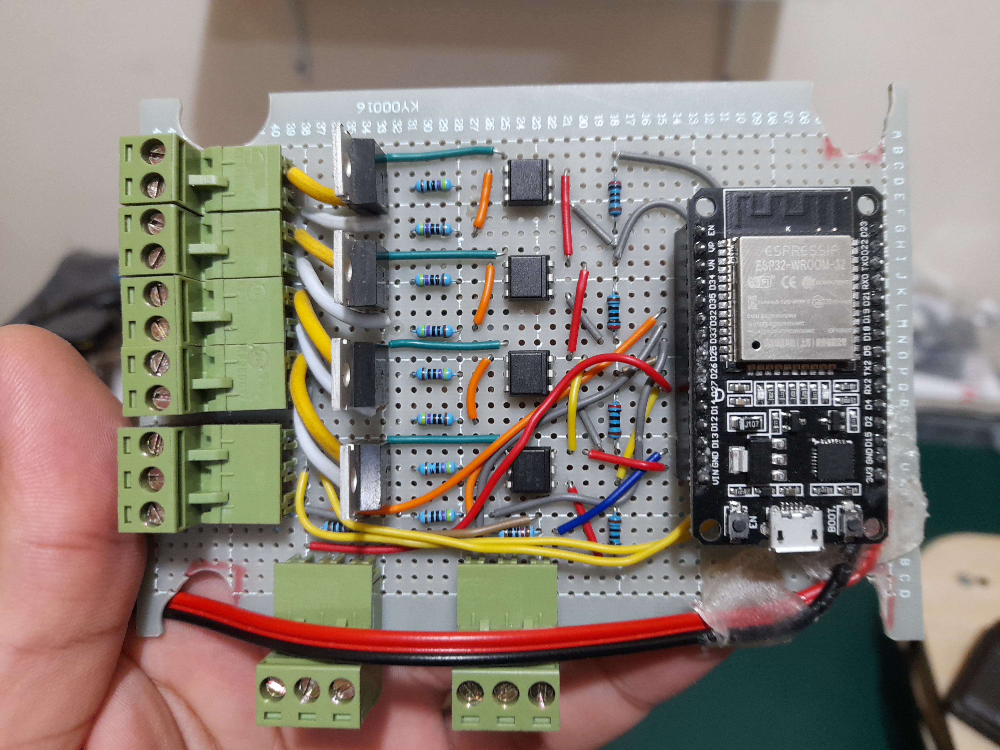
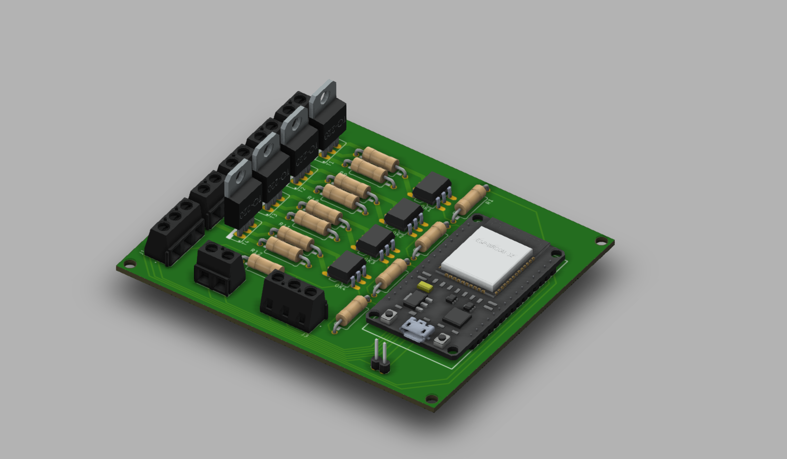
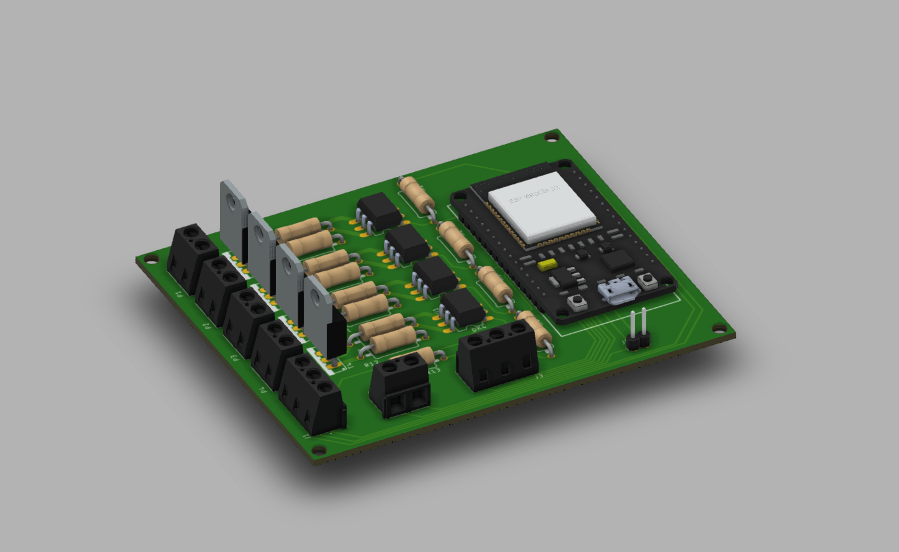

# IoT using ESP32 for Home Control 

## Software 

Programming nodeMCU-32S using [Arduino code](https://github.com/AbdelrahmanEldesouky/IoT-using-ESP32/blob/main/Home%20Control/Software/HomeControl.ino) to connect with io.adafruit platform using MQTT protocol 

## Hardware

### Component 

1. nodeMCU-ESP32S
2. BT139 
3. MOC3022m 
4. PIR Sensor
5. DHT11 
6. LDR 

Check [data sheet](https://github.com/AbdelrahmanEldesouky/IoT-using-ESP32/tree/main/Home%20Control/Hardware/Datasheet) for used components. 

### Schematic 

### Layout 

### Prototype

### PCB 3D View

